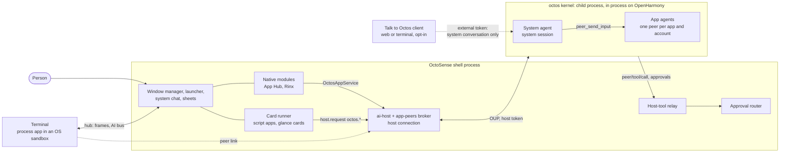
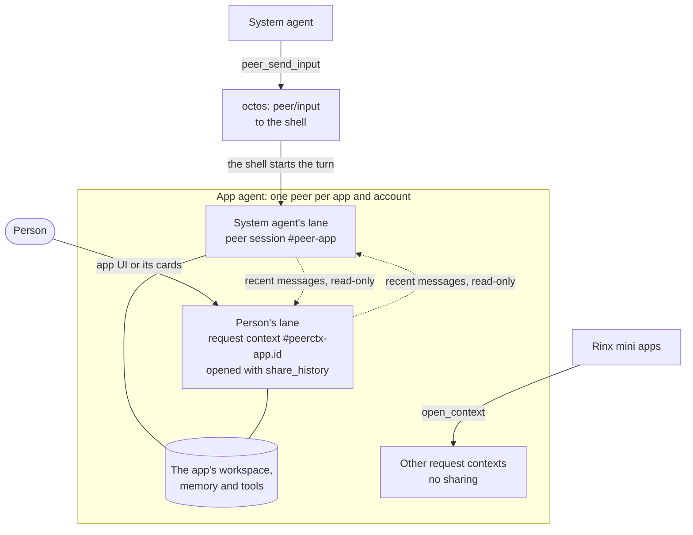
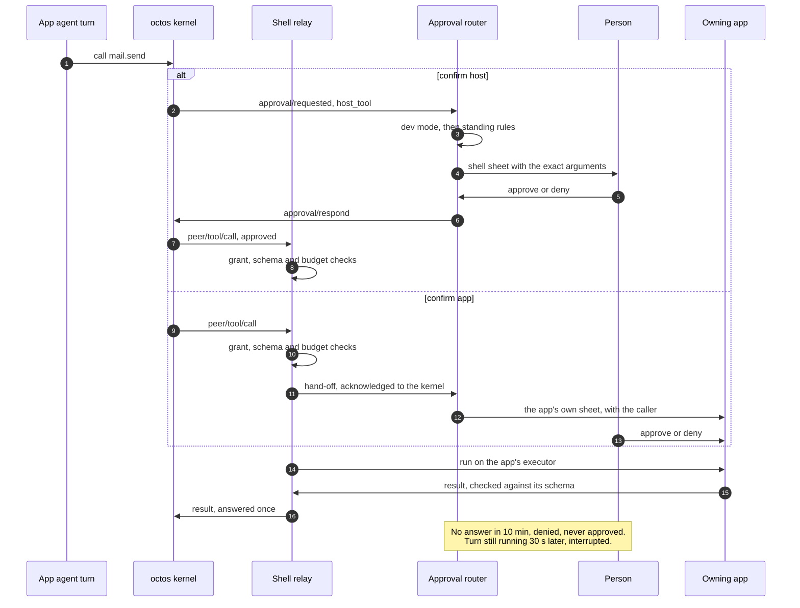

# OctoSense

English | [简体中文](README.zh-CN.md)

[OctoSense](https://github.com/OctoSense-org) is an agent shell on top of your operating system: a launcher and apps that look like the ones you know, with one agent behind them. This repository holds all of OctoSense's own code in one place ([ADR 0001](docs/adr/0001-one-octosense-repository.md)): the shell, its services, the first-party system apps, and the three products built from them.

| Product | What it is | Where |
| --- | --- | --- |
| **OctoSense desktop** | The shell as one Makepad window on macOS (Windows and Linux untested): launcher, dock, tiles, hosted apps | [`desktop/`](desktop/README.md) |
| **OctoSense Home** | The phone shell, an ordinary Home app for any Android phone (also OpenHarmony and the iOS simulator) | [`phone/`](phone/README.md) |
| **OctoSense ROM** | LineageOS 22.2 for the OnePlus 6 with Home, the privileged system bridge, Quickstep and SystemUI preinstalled | [`rom/`](rom/README.md) |

It was OctoSense-Desktop; OctoSense-ROM (retired; merged into this repository) and OctoSense-System-Apps were imported into it with their history on 2026-09-27. OctoSense-System-Apps is archived; the OctoSense-ROM repository no longer exists.

> **Building an OctoSense app?** You do not need this repository to build, check or publish one. Start at the [OctoSense-org profile](https://github.com/OctoSense-org)'s reading list: [OctoScript-App-Design-Flow](https://github.com/OctoSense-org/OctoScript-App-Design-Flow) (`AGENTS.md`, then `docs/QUICKSTART.md`) and [OctoSense-App-Hub](https://github.com/OctoSense-org/OctoSense-App-Hub). The system apps in [`apps/`](apps/README.md) are complete examples of the same app shape (`apps/<name>/bundle/`). Build the desktop shell from here only to see your app in a shell before it is published ([PUBLISHING §4](https://github.com/OctoSense-org/OctoScript-App-Design-Flow/blob/main/docs/PUBLISHING.md#4-rehearse-the-store-path-locally)).

## How it fits together

One shell process per device, one octos kernel per shell, and every agent is a session in that kernel. Apps never talk to the kernel: every path into octos goes through the shell, which holds the host connection and the host token, relays every agent tool call to the app that owns the tool, and puts every approval in front of the person. The full picture, with the code paths and what is on `main` versus planned: [docs/architecture.md](docs/architecture.md); the decisions: [ADR 0004](docs/adr/0004-native-apps-hosting-and-peers.md).

### Processes and connections


<details><summary>Text version (Mermaid)</summary>



</details>

- **The shell** (`crates/shell`, one process) hosts the window manager, the native modules (App Hub, Rinx), App Hub's Card runner (every script app in its own isolate), the system chat, the approval router, the host-tool relay and [`crates/ai-host`](crates/ai-host/README.md), whose [app-peers broker](crates/app-peers/README.md) is the kernel's host connection.
- **The octos kernel** ([`crates/kernel`](crates/kernel/README.md)) starts on first use: a child process speaking OUP over stdio on the desktop (the packaged `octos-kernel` beside the shell, or `OCTOS_APP_CORE_BIN`) and Android (`liboctos.so`), an in-process task on OpenHarmony, none on iOS. It exits with the shell.
- **Process apps**: on the desktop the Terminal runs as its own process, attached over the shell's hub (frames and the AI bus), in an OS sandbox built from its `native-apps.json` entry (Seatbelt on macOS, Landlock and seccomp on Linux, not yet on Windows). A process app reaches its own agent over the **peer link**; the shell side is on `main`, but the Terminal is not granted an agent, so no process app uses it yet.
- **External clients**: Talk to Octos (opt-in) lets a web or terminal client use the system conversation with a limited external token: an allowlist of methods, no `peer/*` method, no app agent's session, no host-routed tools.

### Every path into octos goes through the shell

| Who | Path | Status |
| --- | --- | --- |
| In-process native module | the same peer link as a process app, through Makepad's `OctosPeer` client (the module host claims the link for the instance that opened it) | on `main`; no module uses it yet |
| In-process native module (Rinx) | the injected `OctosAppService`: `open_conversation` (the app's conversation with its agent) and `open_context` (a per-client request context, such as a Rinx mini app) | on `main` |
| Script app, and its cards | `host.request("octos.session.open" / "octos.session.history" / "octos.turn.start" / "octos.turn.interrupt")` to the `octos` host service | on `main`, behind `Policy::contained_apps` (off in the shipped policy) and first-use consent |
| Process app | the peer link on its hub connection (`octos.session.open`, `octos.turn.start`, …), identity stamped by the shell | shell side on `main`; no process app granted an agent yet |
| The system agent | the kernel's own session `_main:api:octosense#system`, reached from the shell's system chat | on `main` |
| Talk to Octos client | the system conversation only, with the external token | on `main` |

### One app agent, two lanes

An app agent is one host-owned octos **peer** per (app, account), owned by the system agent, with its own workspace, memory namespace, model and tool list. The system agent and the person each talk to it in their own lane:


<details><summary>Text version (Mermaid)</summary>



</details>

- **The system agent's lane** is the peer's own session, `…#peer-<app>`. The system agent sends `peer_send_input`; octos delivers it to the shell's host connection as `peer/input`, and the shell starts the turn itself, so it runs with the app's tools, memory and approvals (or refuses it with `peer/input/reject` for a signed-out account or an app the person has not allowed). The peer's results go to the peers' blackboard, which the system agent reads.
- **The person's lane** is a request context, `…#peerctx-<app>.<id>`, opened with `share_history` from the app's UI or its interactive cards (a native module's `open_conversation`, a script app's `octos.session.open`, a process app's peer link), a new one for every handle ([octos#2636](https://github.com/octos-org/octos/pull/2636), UPCR-2026-034). The two lanes run in parallel, one turn at a time per session: a person's message never waits for the system agent's turn. Each turn sees the other lane's recent messages as a read-only block that is never written into its own transcript, and every turn is labelled by its speaker (`[from the person: <app>]`, `[from the system agent]`). The app follows both lanes, each event tagged with its `lane` and speaker; `octos.session.history` merges both transcripts by time. The person's turns also leave rounds on the blackboard (`origin: person`), so the system agent sees them with `peer_gather`.
- *Until 2026-09-29 both spoke in one shared conversation on the peer's session ([#166](https://github.com/OctoSense-org/OctoSense/pull/166), octos#2626): one queue per peer, one turn at a time.*
- **Rinx mini apps** keep their own request contexts (`open_context`), each with its own transcript and folder, not shared with either lane.

### A tool call with an approval


<details><summary>Text version (Mermaid)</summary>



</details>

- **Tool calls**: octos sends `peer/tool/call` to the shell's relay (`crates/shell/src/host_tools/`), which checks the grant by (owning app, tool) and caller, the arguments against the tool's schema and the caller's budget, and routes the call to the owning app's executor: an in-process module's, a script app's host service, a process app's peer link, or the Terminal's `run` on the AI bus.
- **Approvals** go to the approval router (`crates/shell/src/approvals/`): developer mode, then standing rules on (owning app, tool), then a shell-drawn sheet. A `confirm: app` tool is confirmed on the owning app's own sheet, which shows the caller. Only the person approves; the system agent never does.
- **Deadlines and Stop** ([#167](https://github.com/OctoSense-org/OctoSense/pull/167)): an approval or question the shell holds for an app peer expires after 10 minutes (`OCTOSENSE_PROMPT_DEADLINE_SECS`): the router denies it, a question is declined, both stay visible as "Expired: no answer in 10 min". If the turn is still running 30 s later, the broker interrupts it so the next turn can start. The person's Stop ends the running turns of both lanes, the person's and the system agent's.
- **External clients' prompts** stay with the client: the shell does not answer or expire approvals of a Talk to Octos client's turns (octos#2624).

### Cards and questions

- **Interactive cards** ([#153](https://github.com/OctoSense-org/OctoSense/pull/153)): an app's glance cards run under the app's own policy, as the app's UI does in the Card runner; a card published with `notify` also posts a notification, which opens the live card on the glance page or panel. What the person does on a card is the app's own action, through the app's capability gate and host services, not an agent tool call, so it needs no extra shell approval.
- **Questions** (octos's `ask_user_question`) are routed by the turn's trigger: a turn from the person's lane (or the app) asks in the app's conversation, a turn from the system agent's lane asks in the system chat. Only the person answers, on a shell surface.

## Layout

| Path | What it is |
| --- | --- |
| [`desktop/`](desktop/README.md) | Desktop packaging, package `octosense`: the entry point (`src/main.rs` only), catalogs (`config/apps.json`), the window-manager sync from upstream Makepad (`upstream/`, `scripts/upstream.py`), the desktop's system-app selection. |
| [`phone/`](phone/README.md) | The Home app, package `octosense-home` (APK id `dev.makepad.octosense`): the entry point that wraps the shell (`src/main.rs`), the built-in Settings app (`src/settings_*.rs`, `src/android_settings.rs`, `resources/settings/`), Android, OpenHarmony and iOS packaging, the phone side of the system bridge (`android/`), the phone's system-app selection. |
| [`rom/`](rom/README.md) | The OnePlus 6 ROM image only: `vendor/` (product, privileged permissions, overlays, Settings backends, the privileged agent), `patches/`, image, flash and OTA scripts, the Home APK build scripts, `web-installer/`, product tests. |
| `crates/shell/` | The one shell, package `octosense-shell`, linked by both packages: window manager (desk, styles, tiling, scene), hosting (processes, in-process modules, App Hub, the AI pane), the phone layer (home pages, shade, gestures, the Android launcher bridge), themes, wallpapers and icons (`resources/`). |
| [`crates/ai-host/`](crates/ai-host/README.md) | The shell's AI services behind one entry point, package `octosense-ai-host`: the octos kernel service, the `llm` host service with the platform's QR import, and apps' assistant access. |
| [`crates/kernel/`](crates/kernel/README.md) | The octos kernel service, package `octosense-kernel`: the [octos](https://github.com/octos-org/octos) agent kernel as a shell service, one per process, configured by AI providers and shared by its consumers. |
| [`crates/app-peers/`](crates/app-peers/README.md) | The app-agent broker: apps' access to the assistant ([Rinx ADR 0007](https://github.com/hagency-org/Rinx/blob/main/docs/adr/0007-host-owned-octos-app-peers.md)). |
| [`apps/`](apps/README.md) | The system apps (News, Photos, Maps, Camera, Mail, AI providers, YouTube) as contained script apps, their host services (`mail`, `llm`), `apps/reference`, and the opt-in AppCard assistant (`apps/appcard`). |
| `tools/` | `setup.py` (the pinned framework sources), the reviewed Makepad runtime patch (`runtime-patches/`), `kernel-artifact.py` (the octos kernel an Android APK bundles as `liboctos.so`), `check-shell-graph.sh` (the dependency-graph guards every shell build passes). |
| [`docs/adr/`](docs/adr/README.md) | Architecture decisions: this repository's, and the Home decisions 0001–0006 kept as history. |
| `Cargo.toml`, `Cargo.lock` | One workspace. Every external dependency is pinned once in `[workspace.dependencies]`. |
| `native-runtime.lock.json`, `runtime-patches.lock.json` | The OctoScript-Makepad release (and through it Makepad and OctoScript), and the reviewed patch on top of Makepad. |

The shell exists once, in `crates/shell` ([ADR 0001](docs/adr/0001-one-octosense-repository.md)): desktop and phone differ by target and features, not by copies of the source. CI fails if a shell source file appears in two crates.

## What it depends on

Pinned exactly once, in the root `Cargo.toml` and the runtime locks:

| Repository | Role |
| --- | --- |
| [makepad (OctoSense fork)](https://github.com/OctoSense-org/makepad) | The UI framework and the `cargo-makepad` packager. Checked out in `.sources/makepad`, plus the reviewed runtime patch. |
| [OctoScript-Makepad](https://github.com/OctoSense-org/OctoScript-Makepad), [OctoScript](https://github.com/OctoSense-org/OctoScript) | The runtime release that names the Makepad and OctoScript revisions (`native-runtime.lock.json`). |
| [OctoSense-App-Hub](https://github.com/OctoSense-org/OctoSense-App-Hub) | The signed catalog, the store, the Card runner that contains every app (`octosense-app-hub-app`). |
| [octos](https://github.com/octos-org/octos) | The agent kernel. On Android the APK bundles it as `liboctos.so`; on a desktop the kernel service runs the packaged `octos-kernel` beside the shell, checked against this revision (`tools/kernel-artifact.py --host --stage` builds it); `OCTOS_APP_CORE_BIN` overrides it. |
| [Rinx](https://github.com/hagency-org/Rinx) | Matrix chats and mini apps, hosted as a native module. |

Related, not build inputs: [OctoScript-App-Design-Flow](https://github.com/OctoSense-org/OctoScript-App-Design-Flow) (how apps are built and published), [OctoScript-Android](https://github.com/OctoSense-org/OctoScript-Android) and [OctoScript-OH](https://github.com/OctoSense-org/OctoScript-OH) (other renderers), the [OctoSense website](https://github.com/OctoSense-org/octosense-org.github.io).

## AI services (octos)

Each shell runs one [octos](https://github.com/octos-org/octos) agent kernel, started on first use: the APK's `liboctos.so` on Android, in process on OpenHarmony, on a desktop the packaged `octos-kernel` beside the shell (or the binary `OCTOS_APP_CORE_BIN` names), none on iOS. The person chooses its models and types keys in the **AI providers** system app, on host sheets; keys stay in the platform's secret store and never reach an app. [`crates/ai-host`](crates/ai-host/README.md) is the shells' one entry point, and [`crates/app-peers`](crates/app-peers/README.md) gives each granted native app its own octos peer (private contexts, workspace and memory `app/<app>/acct-<hash>`), owned by the shell's system agent. A peer's tool approvals are answered only by the person, in that app; the system agent cannot answer them.

What works today: native modules (Rinx) use their peer; AppCard (opt-in) uses the kernel directly. Contained script apps, system or store, reach it through the `octos` host service in a shell that hosts a kernel: each app gets its own host-owned peer (`card.<app id>`), and its tool approvals go to the shell's approval sheets like every other app agent's ([#155](https://github.com/OctoSense-org/OctoSense/pull/155)). The `llm` service manages providers for `os.*` apps only. An app's own agent (`tools.json`, `AGENT.md`, skills, triggers, glance cards) is [ADR 0002](docs/adr/0002-event-driven-app-agents.md); apps' `tools.json` tools reach their agents end to end since [#160](https://github.com/OctoSense-org/OctoSense/pull/160).

The architecture, the trust model, what each kind of app can use, the plan with its status, and how to run and test it locally: [docs/ai-services.md](docs/ai-services.md). How it fits into the whole system: [docs/architecture.md](docs/architecture.md). For app developers: OctoScript-App-Design-Flow's [AI-SERVICES](https://github.com/OctoSense-org/OctoScript-App-Design-Flow/blob/main/docs/AI-SERVICES.md).

## Set up

Stable Rust (`cargo` in `~/.cargo/bin`), Git, Python 3.9+ (3.11 for `desktop/scripts/upstream.py`) and, on macOS, the Xcode Command Line Tools. Makepad and OctoScript resolve to checkouts in `.sources/` (git-ignored) that the setup script prepares at the pinned revisions:

```sh
git clone https://github.com/OctoSense-org/OctoSense.git
cd OctoSense
python3 tools/setup.py                  # prepare .sources/ (makepad, octoscript, octoscript-makepad)
python3 tools/setup.py --check --cargo  # verify: one Makepad, App Hub, octos and Rinx in the graph
```

`--update` moves clean checkouts after the locks change; `--cache DIR` borrows Git objects from existing clones (`DIR/makepad`, `DIR/octoscript`, `DIR/octoscript-makepad`). Local changes in `.sources/` are preserved.

**Already have clones of these repositories?** Keep one clone of each on the machine and make every `.sources/` entry a `git worktree` of it, so there is one object store per repository and no stale copy. Name the directory that holds the clones (as `<dir>/makepad`, `<dir>/octoscript`, `<dir>/octoscript-makepad`) once, in `~/.config/octosense/sources.json`:

```json
{ "hub": "/path/to/clones" }
```

or per run with `--hub DIR` or `OCTOSENSE_SOURCES_HUB=DIR`; `OCTOSENSE_MAKEPAD_HUB=CLONE` (and `_OCTOSCRIPT_`, `_OCTOSCRIPT_MAKEPAD_`) names one clone, as does `"repositories": {"makepad": "CLONE"}` in the file. Setup then fetches each pinned revision into that clone and runs `git worktree add --detach .sources/<name> <rev>` instead of cloning; `--update` moves the worktrees. Without a hub (CI, a fresh machine) it clones as before, and `--no-hub` forces that. A `.sources/` entry that is already a full clone is reported, not deleted; `--convert` replaces it with a worktree when it holds no local work.

Before deleting a checkout of this repository, remove its `.sources/` worktrees so the clones keep no stale entries:

```sh
python3 tools/setup.py --remove-worktrees   # git worktree remove + prune in each clone; stops on local work
git worktree remove <this checkout>         # if it is itself a worktree
```

By hand, the same is `git -C <clone> worktree remove --force .sources/<name>` (the reviewed Makepad patch is staged, hence `--force`; check `git status` first) and `git -C <clone> worktree prune`.

## Build

**Desktop** (from the root or `desktop/`; details in [desktop/README.md](desktop/README.md)):

```sh
cargo run --release -p octosense
cargo check --locked -p octosense --features mobile-apps                        # the set phones link
cargo check --locked -p octosense -p octosense-appcard --features mobile-apps,app-appcard
```

The assistant needs the octos kernel beside the shell: `python3 tools/kernel-artifact.py --host --stage target/release` builds the pinned revision and stages it, once per octos pin; the desktop refuses a staged kernel of another revision and says so ([Build and run](desktop/README.md#build-and-run)). Without one the desktop runs without an assistant.

**Phone** (from `phone/`, which selects the phone's system apps; details in [phone/README.md](phone/README.md)):

```sh
cd phone
cargo run --release -p octosense-home --features mobile-only    # Home in a phone-sized window
cargo check --locked -p octosense-home --features mobile-apps
python3 ../rom/scripts/build-home.py --help                     # the Home and Bridge APK pair, liboctos.so bundled
```

**ROM image** (Linux build host, external LineageOS tree; not in CI): [rom/README.md](rom/README.md).

Hosted apps and UI tests run with hidden windows and a local control surface: `MAKEPAD_HIDE_WINDOWS=1 MAKEPAD_REMOTE=<port>` (routes under `/help`).

## CI

Path-filtered workflows in `.github/workflows/`, so a change runs only the jobs its paths need:

| Workflow | Runs for | Checks |
| --- | --- | --- |
| `desktop.yml` | `desktop/`, `crates/`, `apps/`, the workspace files, `tools/` | compiles the desktop (default, `mobile-apps`, `mobile-apps,app-appcard`), the shell graph guards (`tools/check-shell-graph.sh`), one copy of every shell source, the `tools/` tests |
| `phone.yml` | `phone/`, `crates/`, `apps/`, the workspace files, `tools/` | compiles Home and its bundled modules, the shell graph guards, and runs the tests of the shell, Home, the AI services, App Hub admission and runtime policy on macOS; the longest job |
| `apps.yml` | `apps/`, `crates/`, the workspace files, `tools/setup.py` | the kernel service, app peers, AI providers config, the Mail and `llm` host services, the shell's AI services (`crates/ai-host`), AppCard |
| `rom.yml` | `rom/`, `phone/android/`, the phone's Android resources and tests, `tools/kernel-artifact.py` | product tests, the generated Agent Binder client, the web installer |
| `release-desktop.yml` | a pushed `desktop-v*` tag, a manual run, or a pull request that changes the packaging (build and scan only) | unsigned desktop packages for macOS, Windows and Linux, the private-path scan; for a tag, signing in the `release` environment and a draft release ([desktop/README.md](desktop/README.md#release-builds)). Not run by `tools/ci-local.sh`. |

Each workflow's graph check (`tools/setup.py --check --cargo`) asserts one Makepad, one App Hub, one octos and one Rinx in the locked graph.

## Releases

ADR 0001 tags each product on its own: `desktop-v*`, `home-v*` (APK), `rom-v*` (image), with build receipts that record the repository commit. A `desktop-v*` tag builds the desktop packages (`.dmg`, Windows installer, `.deb`, `.AppImage`) into a draft release ([Release builds](desktop/README.md#release-builds)). System apps ship only inside the shells, admitted by digest; they are not released separately. The ROM release published before the merge, `20260919-j`, is here as [`rom-v20260919-j`](https://github.com/OctoSense-org/OctoSense/releases/tag/rom-v20260919-j). Phones read `update.json` from the moving `rom-latest` release, not from `releases/latest` ([rom/docs/updates.md](rom/docs/updates.md)). Images `20260919-j` and earlier check the retired OctoSense-ROM repository instead, so a phone flashed with one must be reflashed once to receive updates over the air.

## Contributing

`main` is protected: every change goes through a pull request, and force pushes are blocked. One change is one pull request, across `desktop/`, `phone/`, `crates/` and `apps/` as needed; there are no internal pins to move. Rules for people and coding agents are in [AGENTS.md](AGENTS.md).

## License

Apache License 2.0 ([LICENSE](LICENSE), [NOTICE](NOTICE)). Source copied from Makepad keeps its MIT notice ([LICENSES/](LICENSES)). Dependencies keep their own licenses.
