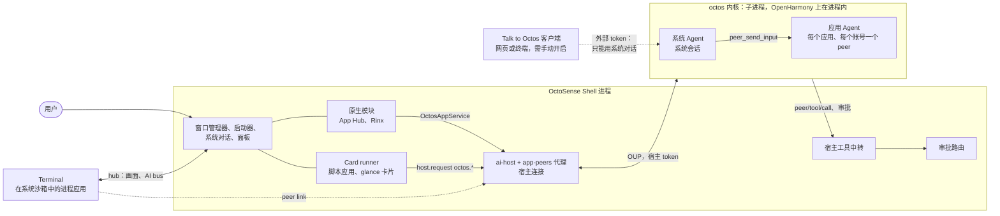
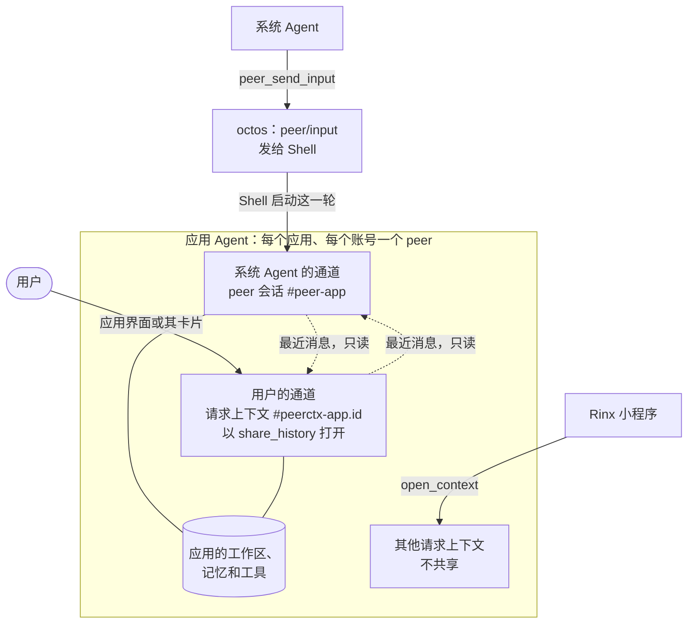
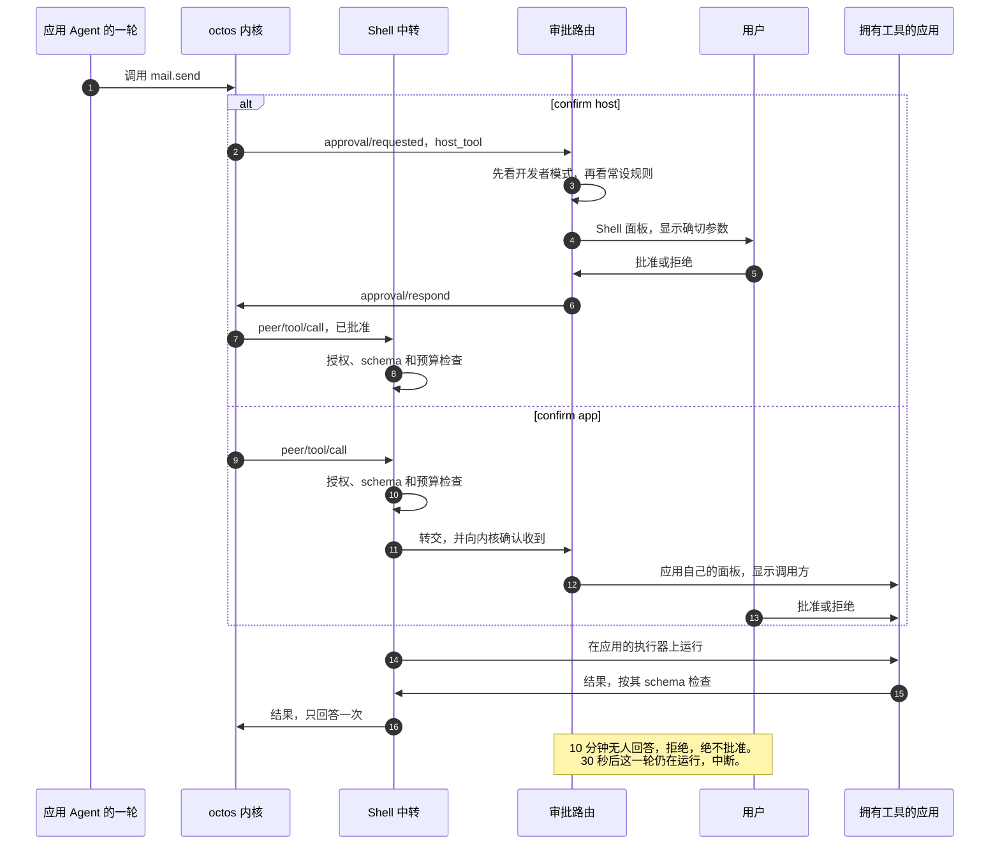

# OctoSense

[English](README.md) | 简体中文

[OctoSense](https://github.com/OctoSense-org) 是运行在操作系统之上的 Agent 交互 Shell：启动器和应用看起来与你熟悉的一样，背后是同一个 Agent。本仓库集中存放 OctoSense 自己的全部代码（[ADR 0001（英文）](docs/adr/0001-one-octosense-repository.md)）：Shell、Shell 服务、第一方系统应用，以及由它们构建的三个产品。

| 产品 | 是什么 | 位置 |
| --- | --- | --- |
| **OctoSense 桌面端** | 在 macOS 上作为一个 Makepad 窗口运行的 Shell（Windows 和 Linux 未经测试）：启动器、dock、平铺窗口、托管应用 | [`desktop/`](desktop/README.zh-CN.md) |
| **OctoSense Home** | 手机 Shell，可作为普通 Home 应用安装在任意 Android 手机上（也支持 OpenHarmony 和 iOS 模拟器） | [`phone/`](phone/README.zh-CN.md) |
| **OctoSense ROM** | 面向 OnePlus 6 的 LineageOS 22.2，预装 Home、具有系统权限的系统桥、Quickstep 和 SystemUI | [`rom/`](rom/README.zh-CN.md) |

本仓库原名 OctoSense-Desktop；OctoSense-ROM（已停用，并入本仓库）和 OctoSense-System-Apps 已于 2026-09-27 连同历史一起导入本仓库。OctoSense-System-Apps 已归档；OctoSense-ROM 仓库已不存在。

> **要开发 OctoSense 应用？** 开发、检查或发布应用都不需要本仓库。请从 [OctoSense-org 主页](https://github.com/OctoSense-org)的阅读列表开始：[OctoScript-App-Design-Flow](https://github.com/OctoSense-org/OctoScript-App-Design-Flow)（先读 `AGENTS.md`，再读 `docs/QUICKSTART.md`）和 [OctoSense-App-Hub](https://github.com/OctoSense-org/OctoSense-App-Hub)。[`apps/`](apps/README.zh-CN.md) 中的系统应用是同样应用结构的完整示例（`apps/<name>/bundle/`）。只有想在发布前先在 Shell 里看到自己的应用时，才需要从这里构建桌面端 Shell（[PUBLISHING §4](https://github.com/OctoSense-org/OctoScript-App-Design-Flow/blob/main/docs/PUBLISHING.md#4-rehearse-the-store-path-locally)）。

## 整体如何运作

每台设备一个 Shell 进程，每个 Shell 一个 octos 内核，每个 Agent 都是这个内核中的一个会话。应用从不直接与内核通信：进入 octos 的每条路径都经过 Shell。Shell 持有宿主连接和宿主 token，把每个 Agent 工具调用转交给拥有该工具的应用，并把每个审批交给用户。完整说明，包括代码路径以及哪些已在 `main` 上、哪些还在规划中：[docs/architecture.zh-CN.md](docs/architecture.zh-CN.md)；相关决策：[ADR 0004（英文）](docs/adr/0004-native-apps-hosting-and-peers.md)。

### 进程与连接


<details><summary>文字版（Mermaid）</summary>



</details>

- **Shell**（`crates/shell`，一个进程）承载窗口管理器、原生模块（App Hub、Rinx）、App Hub 的 Card runner（每个脚本应用都在自己的隔离环境中）、系统对话、审批路由、宿主工具中转，以及 [`crates/ai-host`](crates/ai-host/README.md)；其中的 [app-peers 代理](crates/app-peers/README.md)就是内核的宿主连接。
- **octos 内核**（[`crates/kernel`](crates/kernel/README.zh-CN.md)）首次使用时启动：桌面端（Shell 旁随附的 `octos-kernel`，或 `OCTOS_APP_CORE_BIN`）和 Android（`liboctos.so`）上是通过 stdio 讲 OUP 的子进程，OpenHarmony 上是进程内的任务，iOS 上没有。它随 Shell 一起退出。
- **进程应用**：桌面端的 Terminal 作为独立进程运行，通过 Shell 的 hub 连接（画面和 AI bus），运行在按其 `native-apps.json` 条目构建的系统沙箱中（macOS 上是 Seatbelt，Linux 上是 Landlock 和 seccomp，Windows 上尚未实现）。进程应用通过 **peer link** 使用自己的 Agent；Shell 一侧已在 `main` 上，但 Terminal 没有被授予 Agent，所以目前还没有进程应用使用它。
- **外部客户端**：Talk to Octos（需手动开启）让网页或终端客户端以受限的外部 token 使用系统对话：只有一份方法白名单，不能调用任何 `peer/*` 方法，不能进入任何应用 Agent 的会话，也拿不到宿主路由的工具。

### 进入 octos 的每条路径都经过 Shell

| 谁 | 路径 | 状态 |
| --- | --- | --- |
| 进程内原生模块 | 与进程应用相同的 peer link，经 Makepad 的 `OctosPeer` 客户端（模块宿主把链接归给打开它的实例） | 已在 `main` 上；尚无模块使用 |
| 进程内原生模块（Rinx） | 注入的 `OctosAppService`：`open_conversation`（应用与自己 Agent 的对话）和 `open_context`（每个客户端一个请求上下文，例如 Rinx 小程序） | 已在 `main` 上 |
| 脚本应用及其卡片 | 向 `octos` 宿主服务发送 `host.request("octos.session.open" / "octos.session.history" / "octos.turn.start" / "octos.turn.interrupt")` | 已在 `main` 上，受 `Policy::contained_apps`（发布策略中关闭）和首次使用同意约束 |
| 进程应用 | 其 hub 连接上的 peer link（`octos.session.open`、`octos.turn.start` 等），身份由 Shell 标注 | Shell 一侧已在 `main` 上；尚无进程应用被授予 Agent |
| 系统 Agent | 内核自己的会话 `_main:api:octosense#system`，从 Shell 的系统对话进入 | 已在 `main` 上 |
| Talk to Octos 客户端 | 只能用系统对话，使用外部 token | 已在 `main` 上 |

### 一个应用 Agent，两条通道

一个应用 Agent 就是每个（应用，账号）一个由宿主拥有的 octos **peer**，归系统 Agent 所有，有自己的工作区、记忆命名空间、模型和工具列表。系统 Agent 和用户各自在自己的通道里与它对话：


<details><summary>文字版（Mermaid）</summary>



</details>

- **系统 Agent 的通道**是 peer 自己的会话 `…#peer-<app>`。系统 Agent 发送 `peer_send_input`；octos 把它作为 `peer/input` 交给 Shell 的宿主连接，由 Shell 自己启动这一轮，所以这一轮带着应用的工具、记忆和审批运行（对已退出登录的账号或用户未允许的应用，Shell 以 `peer/input/reject` 拒绝）。peer 的结果写到 peer 黑板上，由系统 Agent 读取。
- **用户的通道**是一个请求上下文 `…#peerctx-<app>.<id>`，由应用界面或其交互式卡片以 `share_history` 打开（原生模块的 `open_conversation`、脚本应用的 `octos.session.open`、进程应用的 peer link），每个句柄一个新的上下文（[octos#2636](https://github.com/octos-org/octos/pull/2636)，UPCR-2026-034）。两条通道并行运行，每个会话同一时间只有一轮：用户的消息不必等系统 Agent 的回合。每一轮都会以只读块的形式看到另一条通道的最近消息，这个块不会写入自己的对话记录；每一轮都标明说话者（`[from the person: <app>]`、`[from the system agent]`）。应用跟随两条通道，每个事件带有 `lane` 和说话者；`octos.session.history` 按时间合并两份对话记录。用户的回合也会在黑板上留下结果（`origin: person`），系统 Agent 用 `peer_gather` 就能看到。
- *2026-09-29 之前两者在 peer 会话上的同一个共享对话中说话（[#166](https://github.com/OctoSense-org/OctoSense/pull/166)，octos#2626）：每个 peer 一个队列，一次一轮。*
- **Rinx 小程序**保留各自的请求上下文（`open_context`），各有自己的对话记录和文件夹，不与任一通道共享。

### 一次带审批的工具调用


<details><summary>文字版（Mermaid）</summary>



</details>

- **工具调用**：octos 把 `peer/tool/call` 发给 Shell 的中转（`crates/shell/src/host_tools/`）。中转按（拥有工具的应用，工具）和调用方检查授权，按工具的 schema 检查参数，检查调用方的预算，再把调用路由到拥有工具的应用的执行器：进程内模块的执行器、脚本应用的宿主服务、进程应用的 peer link，或 AI bus 上 Terminal 的 `run`。
- **审批**交给审批路由（`crates/shell/src/approvals/`）：先看开发者模式，再看针对（拥有工具的应用，工具）的常设规则，否则弹出 Shell 绘制的面板。`confirm: app` 的工具在拥有它的应用自己的面板上确认，面板显示调用方。只有用户能批准；系统 Agent 永远不能。
- **时限与停止**（[#167](https://github.com/OctoSense-org/OctoSense/pull/167)）：Shell 为应用 peer 持有的审批或提问在 10 分钟后过期（`OCTOSENSE_PROMPT_DEADLINE_SECS`）：审批路由拒绝它，提问被婉拒，两者都保持显示为 "Expired: no answer in 10 min"。如果 30 秒后这一轮仍在运行，代理会中断它，好让下一轮开始。用户的“停止”会结束两条通道上正在运行的回合，包括用户的和系统 Agent 的。
- **外部客户端的提示**留在客户端：Shell 不回答、也不让 Talk to Octos 客户端各轮的审批过期（octos#2624）。

### 卡片与提问

- **交互式卡片**（[#153](https://github.com/OctoSense-org/OctoSense/pull/153)）：应用的 glance 卡片在应用自己的策略下运行，与应用界面在 Card runner 中一样；以 `notify` 发布的卡片还会发出一条通知，点开后在 glance 页面或面板上打开这张实时卡片。用户在卡片上的操作是应用自己的操作，经过应用的能力闸门和宿主服务，而不是 Agent 的工具调用，因此不需要额外的 Shell 审批。
- **提问**（octos 的 `ask_user_question`）按这一轮的触发方路由：来自用户通道（或应用）的一轮在应用的对话中提问，来自系统 Agent 通道的一轮在系统对话中提问。只有用户能回答，而且只能在 Shell 的界面上回答。

## 目录结构

| 路径 | 内容 |
| --- | --- |
| [`desktop/`](desktop/README.zh-CN.md) | 桌面端打包，package `octosense`：入口（只有 `src/main.rs`）、应用目录（`config/apps.json`）、从上游 Makepad 同步窗口管理器（`upstream/`、`scripts/upstream.py`），以及桌面端的系统应用选择。 |
| [`phone/`](phone/README.zh-CN.md) | Home 应用，package `octosense-home`（APK id `dev.makepad.octosense`）：包装 Shell 的入口（`src/main.rs`）、内置设置应用（`src/settings_*.rs`、`src/android_settings.rs`、`resources/settings/`）、Android、OpenHarmony 和 iOS 打包、系统桥的手机端（`android/`），以及手机端的系统应用选择。 |
| [`rom/`](rom/README.zh-CN.md) | 仅 OnePlus 6 ROM 镜像：`vendor/`（产品定义、特权权限、overlay、设置后端、特权 agent）、`patches/`、镜像/刷机/OTA 脚本、Home APK 构建脚本、`web-installer/`、产品测试。 |
| `crates/shell/` | 唯一的一份 Shell，package `octosense-shell`，两个包都链接它：窗口管理器（desk、样式、平铺、场景）、托管（子进程、进程内模块、App Hub、AI 面板）、手机层（主屏页面、下拉面板、手势、Android 启动器桥），以及主题、壁纸和图标（`resources/`）。 |
| [`crates/ai-host/`](crates/ai-host/README.md) | Shell 的 AI 服务，统一入口，package `octosense-ai-host`：octos 内核服务、带平台二维码导入的 `llm` 宿主服务，以及应用访问助手的通道。 |
| [`crates/kernel/`](crates/kernel/README.md) | octos 内核服务，package `octosense-kernel`：把 [octos](https://github.com/octos-org/octos) Agent 内核作为 Shell 服务，每个进程一个，由 AI 服务商配置，供所有使用方共享。 |
| [`crates/app-peers/`](crates/app-peers/README.md) | 应用与 Agent 之间的代理：应用访问助手的通道（[Rinx ADR 0007（英文）](https://github.com/hagency-org/Rinx/blob/main/docs/adr/0007-host-owned-octos-app-peers.md)）。 |
| [`apps/`](apps/README.zh-CN.md) | 系统应用（新闻、相册、地图、相机、邮件、AI 服务商、YouTube），均为受隔离约束的脚本应用；它们的宿主服务（`mail`、`llm`）；`apps/reference`；以及需显式启用的 AppCard 助手（`apps/appcard`）。 |
| `tools/` | `setup.py`（锁定版本的框架源码）、经审查的 Makepad 运行时补丁（`runtime-patches/`）、`kernel-artifact.py`（Android APK 以 `liboctos.so` 形式打包的 octos 内核）、`check-shell-graph.sh`（每个 Shell 构建都要通过的依赖图检查）。 |
| [`docs/adr/`](docs/adr/README.zh-CN.md) | 架构决策记录：本仓库的决策，以及作为历史保留的 Home 决策 0001–0006。 |
| `Cargo.toml`、`Cargo.lock` | 一个工作区。所有外部依赖都只在 `[workspace.dependencies]` 中锁定一次。 |
| `native-runtime.lock.json`、`runtime-patches.lock.json` | OctoScript-Makepad 发行版（并通过它确定 Makepad 和 OctoScript），以及 Makepad 之上经审查的补丁。 |

Shell 只有一份，位于 `crates/shell`（[ADR 0001（英文）](docs/adr/0001-one-octosense-repository.md)）：桌面端与手机端以目标平台和 feature 区分，而不是各持一份源码副本。若某个 Shell 源文件同时出现在两个 crate 中，CI 会失败。

## 依赖

只在根目录 `Cargo.toml` 和运行时锁文件中锁定一次：

| 仓库 | 作用 |
| --- | --- |
| [makepad（OctoSense fork）](https://github.com/OctoSense-org/makepad) | UI 框架和 `cargo-makepad` 打包工具。检出到 `.sources/makepad`，并应用经审查的运行时补丁。 |
| [OctoScript-Makepad](https://github.com/OctoSense-org/OctoScript-Makepad)、[OctoScript](https://github.com/OctoSense-org/OctoScript) | 指定 Makepad 和 OctoScript 版本的运行时发行版（`native-runtime.lock.json`）。 |
| [OctoSense-App-Hub](https://github.com/OctoSense-org/OctoSense-App-Hub) | 签名目录、商店，以及隔离运行每个应用的 Card runner（`octosense-app-hub-app`）。 |
| [octos](https://github.com/octos-org/octos) | Agent 内核。在 Android 上 APK 以 `liboctos.so` 形式内置它；在桌面上内核服务运行 Shell 旁随附的 `octos-kernel`，并核对其版本与此处固定的一致（由 `tools/kernel-artifact.py --host --stage` 构建）；`OCTOS_APP_CORE_BIN` 可覆盖它。 |
| [Rinx](https://github.com/hagency-org/Rinx) | Matrix 聊天与小程序，作为原生模块托管。 |

相关但不参与构建：[OctoScript-App-Design-Flow](https://github.com/OctoSense-org/OctoScript-App-Design-Flow)（如何构建和发布应用）、[OctoScript-Android](https://github.com/OctoSense-org/OctoScript-Android) 和 [OctoScript-OH](https://github.com/OctoSense-org/OctoScript-OH)（其他渲染后端）、[OctoSense 网站](https://github.com/OctoSense-org/octosense-org.github.io)。

## AI 服务（octos）

每个 Shell 运行一个 [octos](https://github.com/octos-org/octos) Agent 内核，首次使用时启动：Android 上是 APK 中的 `liboctos.so`，OpenHarmony 上在进程内运行，桌面端运行 Shell 旁随附的 `octos-kernel`（或 `OCTOS_APP_CORE_BIN` 指定的二进制），iOS 上没有。用户在系统应用 **AI providers** 中、在宿主面板上选择模型并输入密钥；密钥保存在平台的密钥存储中，永远不会到达应用。[`crates/ai-host`](crates/ai-host/README.md) 是两个 Shell 的统一入口，[`crates/app-peers`](crates/app-peers/README.md) 为每个获授权的原生应用分配自己的 octos peer（私有的上下文、工作区和记忆 `app/<app>/acct-<hash>`），归 Shell 的系统 Agent 所有。peer 的工具审批只能由用户在该应用中回答，系统 Agent 无法代答。

目前可用的：原生模块（Rinx）使用自己的 peer；AppCard（需主动开启）直接使用内核。隔离运行的脚本应用，无论系统应用还是商店应用，在托管了内核的 Shell 中通过 `octos` 宿主服务使用助手：每个应用有自己的、由宿主拥有的 peer（`card.<应用 id>`），它的工具审批和其他应用 Agent 一样交给 Shell 的审批面板（[#155](https://github.com/OctoSense-org/OctoSense/pull/155)）。`llm` 服务只为 `os.*` 应用管理提供方。应用自己的 Agent（`tools.json`、`AGENT.md`、skills、触发器、glance 卡片）见 [ADR 0002](docs/adr/0002-event-driven-app-agents.md)；自 [#160](https://github.com/OctoSense-org/OctoSense/pull/160) 起，应用 `tools.json` 中的工具已端到端提供给它的 Agent。

架构、信任模型、各类应用能用什么、规划及其状态，以及如何在本地运行和测试：[docs/ai-services.zh-CN.md](docs/ai-services.zh-CN.md)。它在整个系统中的位置：[docs/architecture.zh-CN.md](docs/architecture.zh-CN.md)。面向应用开发者：OctoScript-App-Design-Flow 的 [AI-SERVICES](https://github.com/OctoSense-org/OctoScript-App-Design-Flow/blob/main/docs/AI-SERVICES.zh-CN.md)。

## 环境准备

需要稳定版 Rust（`cargo` 位于 `~/.cargo/bin`）、Git、Python 3.9+（`desktop/scripts/upstream.py` 需要 3.11），macOS 上还需要 Xcode Command Line Tools。Makepad 和 OctoScript 解析到 `.sources/`（已被 git 忽略）中的检出，由环境准备脚本按锁定版本准备好：

```sh
git clone https://github.com/OctoSense-org/OctoSense.git
cd OctoSense
python3 tools/setup.py                  # prepare .sources/ (makepad, octoscript, octoscript-makepad)
python3 tools/setup.py --check --cargo  # verify: one Makepad, App Hub, octos and Rinx in the graph
```

锁文件变化后，`--update` 会把没有本地修改的检出移到新版本；`--cache DIR` 从已有克隆（`DIR/makepad`、`DIR/octoscript`、`DIR/octoscript-makepad`）借用 Git 对象。`.sources/` 中的本地修改会被保留。

**本机已有这些仓库的克隆？** 每个仓库在本机只保留一个克隆，`.sources/` 中的每一项都作为它的 `git worktree`，这样每个仓库只有一个对象库，不会出现过时的副本。在 `~/.config/octosense/sources.json` 中一次性写明存放克隆的目录（其中为 `<dir>/makepad`、`<dir>/octoscript`、`<dir>/octoscript-makepad`）：

```json
{ "hub": "/path/to/clones" }
```

也可以每次运行时用 `--hub DIR` 或 `OCTOSENSE_SOURCES_HUB=DIR` 指定；`OCTOSENSE_MAKEPAD_HUB=CLONE`（以及 `_OCTOSCRIPT_`、`_OCTOSCRIPT_MAKEPAD_`）或文件中的 `"repositories": {"makepad": "CLONE"}` 可单独指定某一个克隆。之后环境准备脚本会把锁定的版本 fetch 到该克隆，并运行 `git worktree add --detach .sources/<name> <rev>`，而不是重新克隆；`--update` 会移动这些 worktree。未配置时（CI、新机器）仍像以前一样克隆，`--no-hub` 可强制如此。`.sources/` 中已经是完整克隆的项只会被报告，不会被删除；其中没有本地工作时，`--convert` 会把它替换为 worktree。

删除本仓库的某个检出之前，先移除它的 `.sources/` worktree，免得各克隆里留下失效的记录：

```sh
python3 tools/setup.py --remove-worktrees   # git worktree remove + prune in each clone; stops on local work
git worktree remove <this checkout>         # if it is itself a worktree
```

手动操作等价于 `git -C <clone> worktree remove --force .sources/<name>`（经审查的 Makepad 补丁处于暂存状态，因此需要 `--force`；先检查 `git status`）以及 `git -C <clone> worktree prune`。

## 构建

**桌面端**（在根目录或 `desktop/` 中运行；详见 [desktop/README.zh-CN.md](desktop/README.zh-CN.md)）：

```sh
cargo run --release -p octosense
cargo check --locked -p octosense --features mobile-apps                        # the set phones link
cargo check --locked -p octosense -p octosense-appcard --features mobile-apps,app-appcard
```

助手需要 Shell 旁的 octos 内核：`python3 tools/kernel-artifact.py --host --stage target/release` 构建固定版本并放到该处，每个 octos 固定版本做一次；桌面会拒绝版本不符的内核并说明原因（[构建与运行](desktop/README.zh-CN.md#构建与运行)）。没有内核时桌面在没有助手的情况下运行。

**手机端**（在 `phone/` 中运行，它会选择手机端的系统应用；详见 [phone/README.zh-CN.md](phone/README.zh-CN.md)）：

```sh
cd phone
cargo run --release -p octosense-home --features mobile-only    # Home in a phone-sized window
cargo check --locked -p octosense-home --features mobile-apps
python3 ../rom/scripts/build-home.py --help                     # the Home and Bridge APK pair, liboctos.so bundled
```

**ROM 镜像**（Linux 构建主机，外部 LineageOS 源码树；不在 CI 中）：[rom/README.zh-CN.md](rom/README.zh-CN.md)。

托管应用和 UI 测试使用隐藏窗口和本地控制接口运行：`MAKEPAD_HIDE_WINDOWS=1 MAKEPAD_REMOTE=<port>`（路由见 `/help`）。

## CI

`.github/workflows/` 中的工作流按路径过滤，每次改动只运行其路径需要的任务：

| 工作流 | 触发路径 | 检查内容 |
| --- | --- | --- |
| `desktop.yml` | `desktop/`、`crates/`、`apps/`、工作区文件、`tools/` | 编译桌面端（默认、`mobile-apps`、`mobile-apps,app-appcard`），Shell 依赖图检查（`tools/check-shell-graph.sh`），每个 Shell 源文件只有一份，`tools/` 的测试 |
| `phone.yml` | `phone/`、`crates/`、`apps/`、工作区文件、`tools/` | 在 macOS 上编译 Home 及其内置模块，Shell 依赖图检查，并运行 Shell、Home、AI 服务、App Hub 准入和运行时策略的测试；耗时最长的任务 |
| `apps.yml` | `apps/`、`crates/`、工作区文件、`tools/setup.py` | 内核服务、app peers、AI 服务商配置、邮件与 `llm` 宿主服务、Shell 的 AI 服务（`crates/ai-host`）、AppCard |
| `rom.yml` | `rom/`、`phone/android/`、手机端的 Android 资源与测试、`tools/kernel-artifact.py` | 产品测试、生成的 Agent Binder 客户端、网页安装器 |

每个工作流的依赖图检查（`tools/setup.py --check --cargo`）确保锁定的依赖图中只有一个 Makepad、一个 App Hub、一个 octos 和一个 Rinx。

## 发布

按 ADR 0001，每个产品单独打标签：`desktop-v*`、`home-v*`（APK）、`rom-v*`（镜像），构建回执记录仓库提交。系统应用只随 Shell 一起发布、按摘要准入，不单独发布。仓库合并前发布的 ROM 版本 `20260919-j` 现为本仓库的 [`rom-v20260919-j`](https://github.com/OctoSense-org/OctoSense/releases/tag/rom-v20260919-j)。手机从固定移动的 `rom-latest` release 读取 `update.json`，而不是 `releases/latest`（[rom/docs/updates.md（英文）](rom/docs/updates.md)）。`20260919-j` 及更早的镜像检查的是已停用的 OctoSense-ROM 仓库，因此刷了这些镜像的手机需要重新刷写一次，才能收到 OTA 更新。

## 参与贡献

`main` 受保护：每个改动都要通过 pull request，禁止强制推送。一个改动就是一个 pull request，按需同时修改 `desktop/`、`phone/`、`crates/` 和 `apps/`；没有内部版本锁需要移动。面向人和编码 Agent 的规则见 [AGENTS.md（英文）](AGENTS.md)。

## 许可证

Apache License 2.0（[LICENSE](LICENSE)、[NOTICE](NOTICE)）。从 Makepad 复制的源码保留其 MIT 声明（[LICENSES/](LICENSES)）。依赖项保留各自的许可证。
